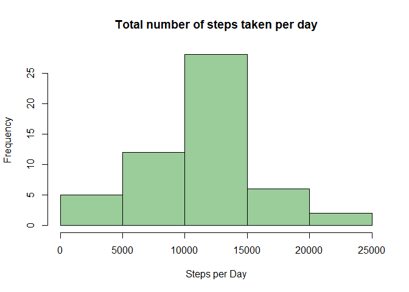
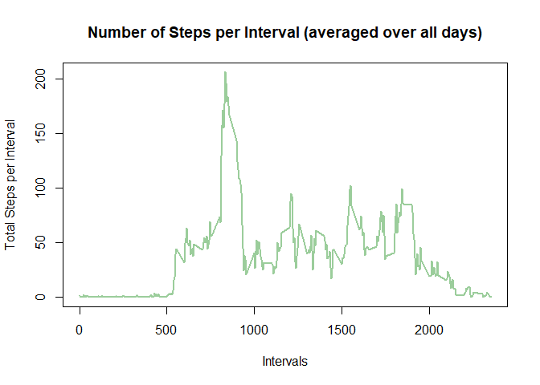
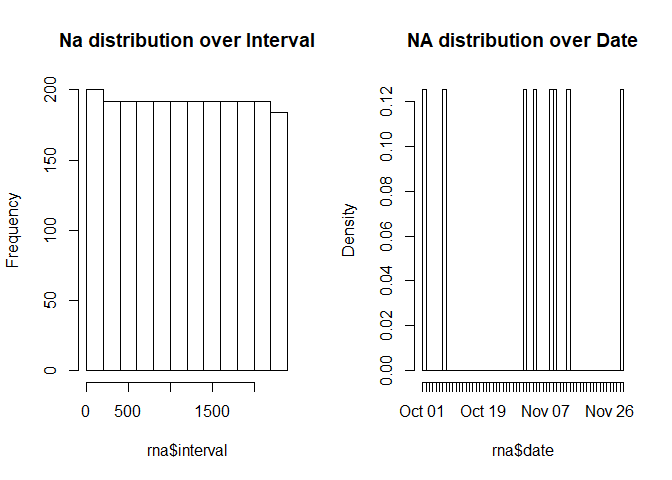
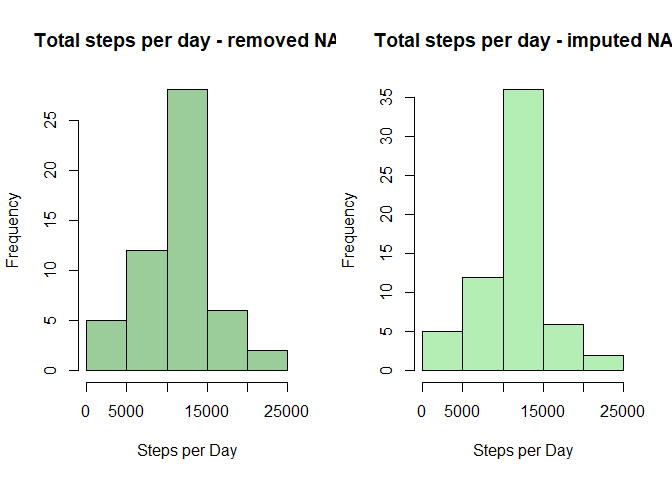
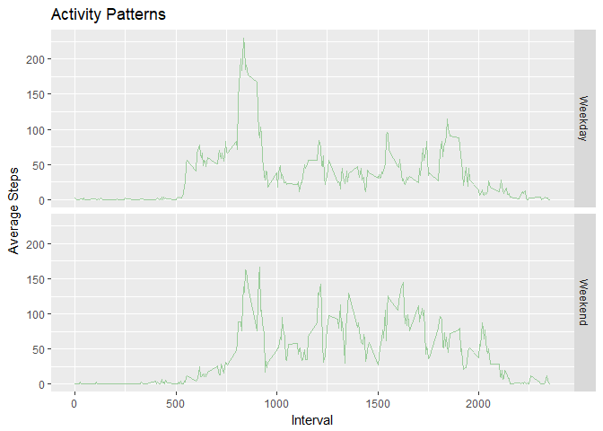

## Loading and preprocessing the data
* Working directory is set to the clone of the github repository
* Omitting the Na's in this step

```r
rm(list=ls())
activity <- read.table(unzip('activity.zip','activity.csv'),header=TRUE,sep=',')

#get rid of the NAs
tactivity <- na.omit(activity)
```

## What is the mean total number of steps taken per day?

First summarize the steps for each day with the aggregate function.
And calculate the numbers for question 2

```r
steps_day <- aggregate(steps~date, data=tactivity, FUN=sum)
steps_day_mean <- format(mean(steps_day$steps),digits=1)
steps_day_median <- format(median(steps_day$steps),digits=1)
```
### 1. Make a histogram of the total number of steps taken each day

```r
hist(steps_day$steps, xlab = 'Steps per Day', main = 'Total number of steps taken per day', col = 'darkseagreen3')
```

<!-- -->
This is just to get an overview therefore no custom breaks are built into the histogram

### 2. Calculate and report the **mean** and **median** total number of steps taken per day

The following numbers are formated to a normal number to make more sense 

* Mean steps per Day: **10766**  

* Median steps per Day: **10765**


## What is the average daily activity pattern?

### 1. Time Series plot 
Make a time series plot (i.e. `type = "l"`) of the 5-minute interval (x-axis) and the average number of steps taken, averaged across all days (y-axis)

First we aggregate the data in order to achieve the average and then we plot the activity


```r
steps_act_mean <- aggregate(steps~interval, data=tactivity,FUN=mean)
plot(steps_act_mean$interval, steps_act_mean$steps, type = 'l', col = 'darkseagreen3', lwd=2, xlab = 'Intervals', ylab = 'Total Steps per Interval', main = 'Number of Steps per Interval (averaged over all days)' )
```

<!-- -->

### 2. Which 5-minute interval contains the maximum number of steps?


```r
max_steps_int <- max(steps_act_mean$steps)
maxint <- steps_act_mean$interval[which(max_steps_int == steps_act_mean$steps)]
```
* Max Number of Steps per Interval: **206.1698113**  

* Median steps per Day: **835**


## Imputing missing values

### 1. Calculate and report the total number of missing values in the dataset

```r
summary(activity)
```

```
##      steps                date          interval     
##  Min.   :  0.00   2012-10-01:  288   Min.   :   0.0  
##  1st Qu.:  0.00   2012-10-02:  288   1st Qu.: 588.8  
##  Median :  0.00   2012-10-03:  288   Median :1177.5  
##  Mean   : 37.38   2012-10-04:  288   Mean   :1177.5  
##  3rd Qu.: 12.00   2012-10-05:  288   3rd Qu.:1766.2  
##  Max.   :806.00   2012-10-06:  288   Max.   :2355.0  
##  NA's   :2304     (Other)   :15840
```

```r
sum(is.na(activity))
```

```
## [1] 2304
```
Double checked the Na-Values with summary. All Values not available are found in the column steps. 

### 2. Devise a strategy for filling in all of the missing values in the dataset.
To get a useful strategy we need to check the distribution of NA's

```r
#subset for rows with NA's for we know that NA's are only in the column steps 
rna <- subset(activity,is.na(steps))
rna$date <- as.Date(rna$date)
#check for distribution over intervals and Date (factor levels = 61)
par(mfrow=c(1,2))
hist(rna$interval, main= 'Na distribution over Interval')
hist(rna$date, main= 'NA distribution over Date',breaks = 61)
```

<!-- -->

We can see in the plots that it is best to take the mean of the interval for those values missing because the distribution is equaly spread over all intervals. Hence this will be the strategy.

### 3. Create a new dataset that is equal to the original dataset but with the missing data filled in.

Given the strategy from 2. we will replace all the NA values with the mean over all dates for the corresponding interval.

* calculating mean for each interval

* replace the na values 

```r
#tapply for the mean for each interval
int_mean <- tapply(tactivity$steps, tactivity$interval,mean)

#separate na values in order to replace them and make interval a factor in order to change levels 
act_na <- rna
act_na$steps <- as.factor(act_na$interval)
levels(act_na$steps)<- int_mean

# round in order to get a logic value and reformat to int
levels(act_na$steps) <- round(as.numeric(levels(act_na$step)))
act_na$steps <- as.integer(as.vector(act_na$steps))

#add all data together
impactivity <- rbind(act_na, tactivity)
```

The new generated dataset is called impactivity.

### 4. Make a histogram report the **mean** and **median** total number of steps taken per day. 
Compare the original dataset with the new dataset.

```r
par(mfrow=c(1,2))
#Histogram from the beginning
hist(steps_day$steps, xlab = 'Steps per Day', main = 'Total steps per day - removed NA', col = 'darkseagreen3')
#Histogram with the new dataset
steps_day_imp <- aggregate(steps~date,data=impactivity,FUN=sum)
hist(steps_day_imp$steps, xlab = 'Steps per Day', main = 'Total steps per day - imputed NA', col = 'darkseagreen2')
```

<!-- -->

The plots suggest no major significant influence only a higher frequency which makes sense because we have more observations  

Now compute the mean and median for the new dataset


```r
steps_day_imp_mean <- format(mean(steps_day_imp$steps),digits=1)
steps_day_imp_median <- format(median(steps_day_imp$steps),digits=1)
```


The following table will compare the **mean** and **median** of both data sets

------ | Data Removed NA     | Data Imputed NA
------ | ------------------- | ---------------
**mean**   | 10766  | 10766
**median** | 10765| 10762


We can conclude that imputing the dataset did not change the mean but the median by **0.0279 %** which can be seen as insignificant.  
As mentioned bevor the structure of the data looks the same only the frequency is higher due to more observations.


## Are there differences in activity patterns between weekdays and weekends?
### 1. create binary factor for weekday or weekend (sat, sun)

```r
#taking the imputed dataset 
impactivity$type <- ifelse(weekdays(impactivity$date)=='Saturday'| weekdays(impactivity$date) == 'Sunday','Weekend','Weekday')
#format it to a factor
impactivity$type <- as.factor(impactivity$type)
```

### 2. Make a panel plot containing a time series plot 

```r
#generate data for the plot
weekdat <- aggregate(steps~interval+ type, data =impactivity, FUN = mean)

#plot - use ggplot
library(ggplot2)
p_weekdat <- ggplot(weekdat, aes(interval, steps)) +
         geom_line(color = "darkseagreen3") + 
         facet_grid(type~.) + 
         labs(x = "Interval", y = "Average Steps", title = "Activity Patterns")
p_weekdat
```

<!-- -->

You can see that the steps are more spread over the day on the weekends and on weekdays on average the highest peak is in the morning.

